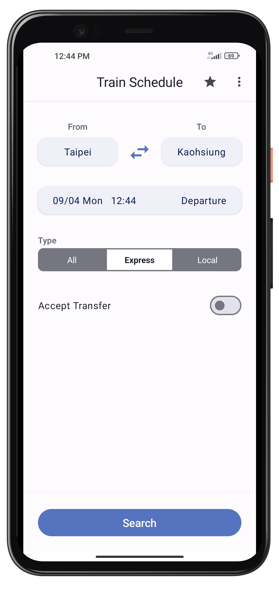
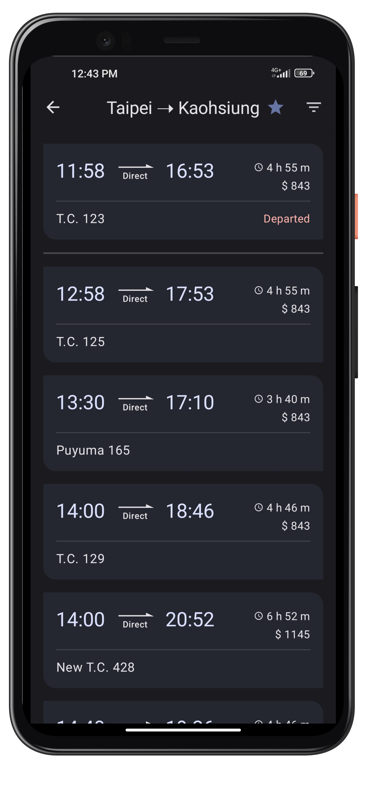
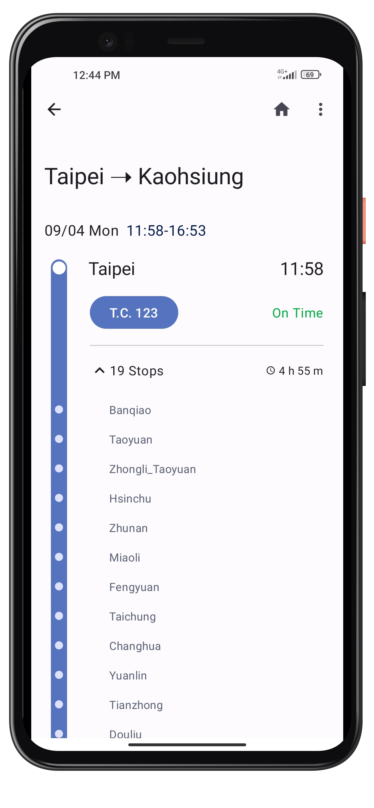
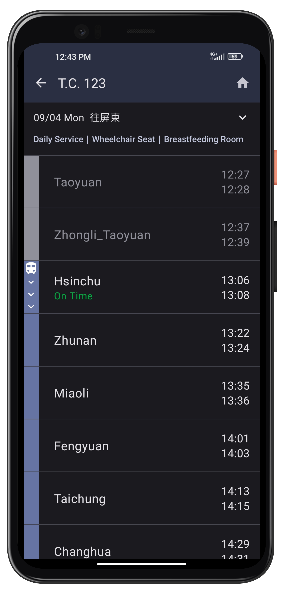
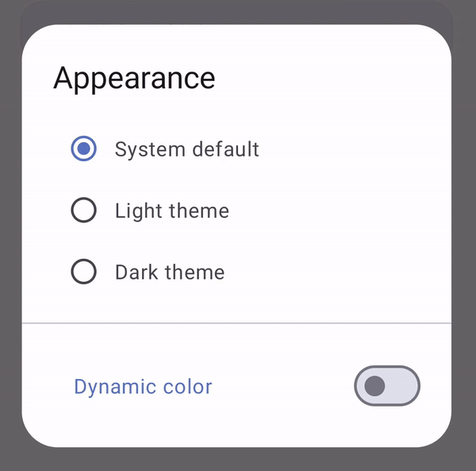

# TrainSchedule

**Train Schedule** is an Android application for Taiwan railway timetable inquiries.  
It is based on **Jetpack Compose** and **Material 3** for UI development, while adhering to Google's recommended architecture and the latest Android tech.
  

  <a href="https://play.google.com/store/apps/details?id=com.kappstudio.trainschedule">
    

 

## Features

* 100% Jetpack Compose
* Material Design 3
* Domain layer with UseCase
* Flow & StateFlow
* Dagger-Hilt
* UDF pattern
* DTO pattern
* Jsoup
* Retrofit
* Room
* DataStore
* Dark theme & Dynamic color

## Tech Stacks
* [Jetpack Compose](https://developer.android.com/jetpack/compose) - Build declarative and reusable UI with Kotlin
* [Material 3](https://m3.material.io/) - Google’s design system for UI components, color, font style, and shapes
* [Dagger-Hilt](https://developer.android.com/training/dependency-injection/hilt-android) - Implement dependency injection
* [Jsoup](https://jsoup.org/) - Scrape documents from websites and parse HTML forms
* [Flow](https://developer.android.com/kotlin/flow) - Handle asynchronous data with observable streams
* [StateFlow](https://developer.android.com/kotlin/flow/stateflow-and-sharedflow#stateflow) - Enable flows to optimally emit state updates and values to multiple consumers
* [Compose Navigation](https://developer.android.com/jetpack/compose/navigation) - Navigate between composable screens
* [Retrofit](https://github.com/square/retrofit) - Fetche data from the server through RESTful API
* [Room](https://developer.android.com/training/data-storage/room) - Local persistence database
* [Datastore](https://developer.android.com/topic/libraries/architecture/datastore) - Aynchronous and consistent data storage for key-value pairs or typed objects
* [Dynamic color](https://developer.android.com/jetpack/compose/designsystems/material3#dynamic_color_schemes) - Derive custom colors from a user's wallpaper to be applied to the app UI

  

 

## Architectures
 

Follow Google recommended [Guide to app architecture](https://developer.android.com/jetpack/guide) to structure project architecture based on UI layer, Date layer and Domain layer.

### UI layer
* **ViewModel**: Fetch data from higher layers, update UI State(StateFlow) and handle UI events
* **Composable Screen**: Collect the UI state from the ViewModel as an immutable state, then pass it down to composable widgets for displaying the UI. Invoke the ViewModel's function when a UI event occurs

### Domain layer
 * **Use Case**: Responsible for encapsulating complex business logics, and can be reused by multiple ViewModels
 * **Model**: Data classes that are representing real-world concepts for the user
* **Repository Interface**: Define a contract for data access and provide methods for retrieving
  
### Date layer
* **RepositoryImpl**: Implement the repository interface methods from domain layer
* **DataSource**: Retrofit, Room, DataStore
* **ModelMappingExt**: Provide extension functions to map between remote DTO, local entity, and domain model
 

## 3rd Libraries
* [Timber](https://github.com/JakeWharton/timber) - Logger with a small, extensible API
* [WheelPickerCompose](https://github.com/commandiron/WheelPickerCompose) - Date and time wheel picker in Jetpack Compose
 

## Api Source
* [TDX Api](https://tdx.transportdata.tw/api-service/swagger) 
 

## Learning Resources
<a href="https://developer.android.com/courses/android-basics-compose/course?hl=en">Android Basics with Compose</a> 
<a href="https://developer.android.com/topic/architecture">Guide to app architecture</a> 
<a href="https://developer.android.com/jetpack/compose/architecture">Architecting your Compose UI</a> 
<a href="https://youtu.be/1yiuxWK74vI?si=TwmxcFl0AQnSNJxJ">Introduction to drawing in Compose</a> 

